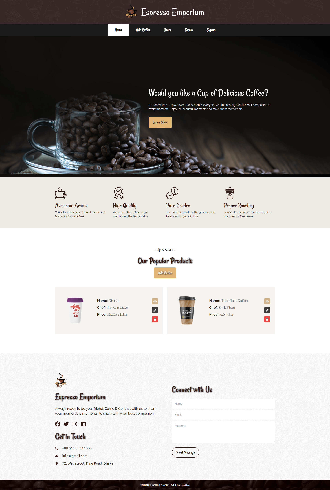

# Coffee Shop 

### Features
- Authentication using firebase
- and user list save in database
- Complete Frontend 
- Complete backend
- CRUD Operation
- MongoDB Database
- Express ,Nodejs backend server
- React Router DOM

### Frontend
- <a href="https://coffee-shop-client-phi.vercel.app/">Website Link</a>
- <a href="https://github.com/promahbubul/coffee-shop-client">Repository Link</a>

### Backend
- <a href="https://coffee-shop-server-pink.vercel.app/">Api Sever Link</a>
- <a href="https://github.com/promahbubul/coffee-shop-server">Repository Link</a>

- 

